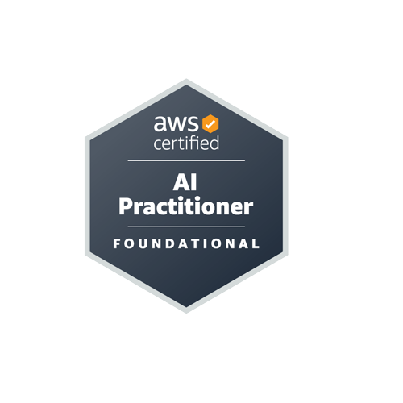

# AWS Certified AI Practitioner Study Notes (AIF-C01)

- This will help you for quick revision before exam.

- If you are studying for AWS AI Practitioner certifications or you already have them but want to have digital notes of what you studied, here it is and you can come back as many times as you need. I share the notes I used to study and pass my exam.

Below Table Link containing information about each sections in detail.

## Table of contents

- Generative AI and Amazon Bedrock
  - [GenAI Introduction](./section/gen-ai/genai-introduction.md)
    - What is Generative AI?, What is Foundation Model?, Generative Language Models, GenAI for Images
