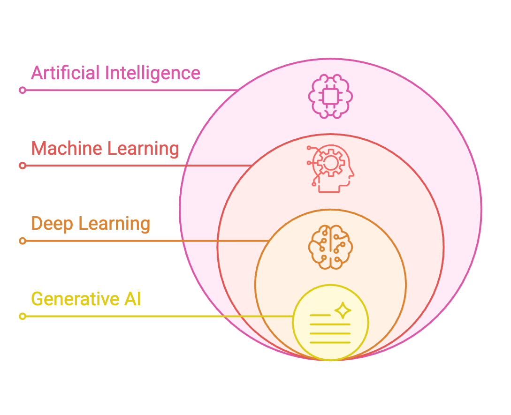
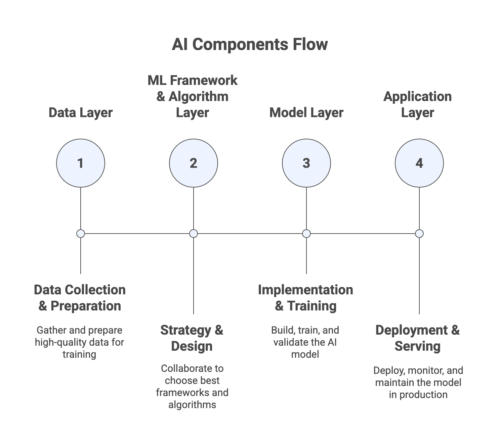

# AI and Machine Learning Overview

- [AI and Machine Learning Overview](#ai-and-machine-learning-overview)
  - [What is AI?](#what-is-ai)
  - [AI Components](#ai-components)
  - [What is Machine Learning (ML)?](#what-is-machine-learning-ml)
  - [What is Deep Leaning(DL)?](#what-is-deep-leaningdl)
    - [Neural Networks - how do they work?](#neural-networks---how-do-they-work)
  - [What is Generative AI?](#what-is-generative-ai)
  - [What is the Transformer Model? (LLM)](#what-is-the-transformer-model-llm)
  - [Diffusion Models](#diffusion-models)
  - [Multi-Modal Models](#multi-modal-models)
  - [ML Terms You Need to Know](#ml-terms-you-need-to-know)
  - [Training Data](#training-data)
    - [Labeled Data](#labeled-data)
    - [Unlabeled Data](#unlabeled-data)
    - [Structured Data](#structured-data)
    - [Unstructured Data](#unstructured-data)
  - [Supervised Learning](#supervised-learning)
    - [Regression](#regression)
    - [Classification](#classification)
    - [Training vs. Validation vs. Test Sets](#training-vs-validation-vs-test-sets)
    - [Feature Engineering](#feature-engineering)
      - [Feature Engineering on Structured Data](#feature-engineering-on-structured-data)
      - [Feature Engineering on Unstructured Data](#feature-engineering-on-unstructured-data)
  - [Unsupervised Learning](#unsupervised-learning)
    - [Clustering Technique](#clustering-technique)
    - [Association Rule Learning](#association-rule-learning)
    - [Anomaly Detection](#anomaly-detection)
  - [Semi-Supervised Learning](#semi-supervised-learning)

## What is AI?

- Broad field focused on developing intelligent systems capable of performing tasks that typically require human intelligence
- **Core Capabilities**:
  - Perception: Understanding visual/audio data
  - Reasoning: Drawing logical conclusions
  - Learning: Improving from experience
  - Problem solving: Finding solutions to complex problems
  - Decision making: Choosing optimal actions
- Umbrella term encompassing various techniques and approaches
- **Common Use Cases**:
  - Computer vision for self-driving cars
  - Facial recognition
  - Fraud detection
  - Intelligent Document Processing (IDP)

## AI Components

- **Data Layer**: Collection and preparation
  - Collect vast amounts of high-quality data
  - Critical foundation for model performance
  - Data quality determines model quality

- **ML Framework and Algorithm Layer**: Strategy and design
  - Data scientists and engineers collaborate to understand:
    - Use cases and business requirements
    - Available frameworks and algorithms
    - Best approaches to solve the problem

- **Model Layer**: Implementation and training
  - Implement the model structure
  - Set parameters and configurations
  - Train the model using optimization functions
  - Tune and validate performance

- **Application Layer**: Deployment and serving
  - Deploy trained model to production
  - Expose model capabilities to end users
  - Monitor performance in real-world scenarios
  - Maintain and update as needed

## What is Machine Learning (ML)?

- Type of AI that enables systems to learn and improve from data without explicit programming
- Machines learn patterns from data rather than following programmed rules
- Build methods that allow machines to make predictions and decisions based on learned patterns
- Data-driven: Improves performance by processing large datasets
- Pattern recognition: Identifies patterns and relationships in data
- Predictive capability: Makes predictions on new, unseen data
- Non-programmatic: Learns without explicit rule programming
- **AI ≠ ML**: AI is broader, ML is one approach within AI
- Most modern AI systems leverage ML techniques

## What is Deep Leaning(DL)?

- Subset of machine learning inspired by the structure and function of the human brain
- Uses neurons and synapses (like the brain) to train models
- Processes more complex patterns than traditional ML techniques
- **Deep** refers to multiple layers of learning/hidden layers
- Handles more intricate relationships than traditional regression/classification
- Automatically extracts features without manual feature engineering
- Leverages increasing data and computational resources effectively
- **Key Requirements:**
  - **Large Datasets**: Needs substantial amounts of training data for good performance
  - **Computational Resources**: Training is computationally intensive, typically using GPUs (Graphics Processing Units)
  - **Time**: Training deep models requires significant time investment
- **Applications**
  - Computer Vision
    - Image classification: Categorizing images into classes
    - Object detection: Locating and identifying objects in images
    - Image segmentation: Partitioning images into meaningful regions
    - Facial recognition: Identifying faces in images
  - Natural Language Processing (NLP)
    - Text classification: Categorizing text documents
    - Sentiment analysis: Determining emotional tone of text
    - Machine translation: Translating between languages
    - Language generation: Creating human-like text

### Neural Networks - how do they work?

- Computational models composed of interconnected layers of nodes (neurons) that process and transform input data
- Processes input data through multiple layers, extracting features and making predictions
- Nodes are organized in layers
- When the neural network sees a lot of data, it identifies patterns and changes the connections between the nodes
- Nodes are **talking** to each other, by passing on (or not) data to the next layer
- The math and parameters tuning behind it is beyond the level of this course
- Neural networks may have billions of nodes
- **Input Layer**:
  - Receives raw input data
  - Each neuron represents one feature of input data
  - No processing occurs here
- **Hidden Layers**:
  - Intermediate layers between input and output
  - Multiple hidden layers create **deep** networks
  - Perform computations and extract features from input data
  - Different layers learn different levels of abstraction
- **Output Layer**:
  - Final layer producing the prediction or classification
  - Structure depends on task:
    - Regression: Single neuron with continuous output
    - Classification: Multiple neurons with probability outputs

## What is Generative AI?

- Generative AI is a branch of Deep Learning
- The idea is simple: you train a model on existing data, and it learns to create new data that looks similar
- Think of it like teaching someone to paint by showing them thousands of paintings
- Once trained, it can create brand new content that follows the same patterns

## What is the Transformer Model? (LLM)

- Architecture that processes entire sequences at once rather than sequentially word-by-word
- Revolutionary approach enabling efficient, parallel text processing
- Faster training and better handling of long-range dependencies
- Reduces training time significantly
- It gives relative importance to specific words in a sentence
- Scales well to large datasets and models
- Transformer-Based LLMs
  - Powerful models that can understand and generate human-like text
  - Trained on vast amounts of text data from the internet, books, and other sources, and learn patterns and relationships between words and phrases
  - **Examples**:
    - **Google BERT**: Bidirectional Encoder Representations from Transformers
    - **OpenAI ChatGPT**: Chat Generative Pre-Trained Transformer
  - Modern transformers can have billions of parameters
  - Can be adapted to many NLP tasks through fine-tuning

## Diffusion Models

- Used in machine learning, particularly for generating complex data such as images, audio, and even text
- Key concepts:
  - Generative Modeling: learn the underlying distribution of a dataset and generate new data points that are similar to the training data
  - Forward Diffusion Process: the diffusion process begins by gradually adding noise to the data (e.g., an image) over a series of steps until the data is completely transformed into noise
  - Reverse Diffusion Process: generative part of the model, where the goal is to start from pure noise and iteratively remove the noise, effectively reversing the forward diffusion process, to generate new data that resembles the original training data

## Multi-Modal Models

- Models that can process and generate multiple types of data simultaneously
- Handle diverse input and output formats in single model
- Combines information from different modalities for richer understanding
- Examples:
  - **Image + Audio → Video**: Take image of cat and audio file, generate video of cat speaking the audio
  - **Image → Text**: Analyze image and generate descriptive caption
  - **Text + Image → Text**: Analyze both and generate combined interpretation

## ML Terms You Need to Know

- **GPT (Generative Pre-trained Transformer)** – generate human text or computer code
based on input prompts
- **BERT (Bidirectional Encoder Representations from Transformers)** – similar intent to GPT, but reads the text in two directions
- **RNN (Recurrent Neural Network)** – meant for sequential data such as time-series or text, useful in speech recognition, time-series prediction
- **ResNet (Residual Network)** – Deep Convolutional Neural Network (CNN) used for image recognition tasks, object detection, facial recognition
- **SVM (Support Vector Machine)** – ML algorithm for classification and regression
- **WaveNet** – model to generate raw audio waveform, used in Speech Synthesis
- **GAN (Generative Adversarial Network)** – models used to generate synthetic data such as images, videos or sounds that resemble the training data. Helpful for data augmentation
- **XGBoost (Extreme Gradient Boosting)** – an implementation of gradient boosting

## Training Data

- Good training data is essential for building effective machine learning models
- Poor quality data results in poor model performance
- **Good** data must be defined appropriately for the specific use case
- Training data selection and preparation is one of the most critical stages in building an effective model
- There are several options to model our data, which will impact the types of algorithms we can use to train our models
- **Labeled vs. Unlabeled Data**
- **Structured vs. Unstructured Data**

### Labeled Data

- Consists of both input features and output labels
- Each data point has an associated correct answer
- **Example**: Dataset of animal images where each image is labeled as "dog" or "cat"
  - Input feature: The image itself
  - Output label: The animal type
- Used for supervised learning
- Algorithm learns to map inputs to known outputs by studying labeled examples
- When correct answers are known and can be applied to new data
- Labeling large datasets can be costly and time-consuming

### Unlabeled Data

- Includes only input features without any output labels
- Raw data without associated correct answers
- Example: Collection of images without labels indicating whether they are cats or dogs, etc...
- Used for unsupervised learning
- Algorithm must identify patterns or structures within the data itself (e.g., grouping similar images)

### Structured Data

- Organized in a defined format, typically rows and columns
- Similar to a spreadsheet with clearly defined fields
- Other type of structured data is Time Series Data, where data points are collected and recorded at successive points in time

### Unstructured Data

- Does not follow a specific format or structure
- Often text-heavy or multimedia content without predefined organization
- **Text Data**: Online articles, social media posts, customer reviews, long-form feedback, etc...
- **Image Data**: Photos and visual content, consists of pixels without organized metadata
- **Other Types**: Audio files and speech recordings, video content, free-form text documents,
- Requires specialized algorithms to extract information

## Supervised Learning

- Learn a mapping function that can predict the output for new, unseen input data
- Requires labeled data (input features + output labels)
- Very powerful for prediction tasks
- Obtaining labeled data for millions of data points can be difficult and costly
- Trains model on labeled examples so it learns patterns connecting inputs to outputs

### Regression

- Predict continuous numeric values based on input data
- Continuous variable that can take any value within a range
- **Examples**:
  - Predicting house prices based on size, location, features
  - Predicting stock prices
  - Weather forecasting (temperature, rainfall)
  - Predicting customer spending behavior

### Classification

- Used to predict categorical labels of input data
- Output variable is a discrete variable representing specific categories or classes
- Use cases: scenarios where decisions or predictions need to be made between distinct categories (fraud, image classification, customer retention, diagnostics)
- Types of Classification
  - **Binary Classification**:
    - Two possible classes
    - Example: Spam/Not spam, Fraud/Not fraud
    - Yes/No decisions
  - **Multiclass Classification**:
    - More than two classes
    - Example: Animals (cat, dog, giraffe)
    - Example: Image recognition (0-9 digits)
  - **Multi-label Classification**:
    - Multiple labels per instance
    - Example: Movie can be both "Action" and "Comedy"
    - Example: Document tagged as both "urgent" and "financial"
- **Key algorithm**: K-nearest neighbors (k-NN) model

### Training vs. Validation vs. Test Sets

- **Training Set**: 60-80% of data
  - Used to train the model
  - Model learns patterns from this data
  - Most important for learning
- **Validation Set**: 10-20% of data
  - Used to tune model parameters
  - Validate performance during training
  - Helps prevent overfitting
  - Test different configurations
- **Test Set**: 10-20% of data
  - Used to evaluate final model accuracy
  - Never seen by model during training
  - Represents unseen data performance
  - Final evaluation metric

### Feature Engineering

- Process of using domain knowledge to select and transform raw data into meaningful features
- Helps enhancing the performance of machine learning models
- Techniques
  - **Feature Extraction**:
    - extract useful information from raw data
    - Example: Calculate age from birth date, extract hour from timestamp, calculate BMI from height and weight
  - **Feature Selection**:
    - Choose subset of relevant features
    - Remove redundant or irrelevant features
    - Improve model efficiency and interpretability
    - Example: Select important predictors in regression model
  - **Feature Transformation**:
    - Transform data for better model performance
    - such as normalizing numerical data

#### Feature Engineering on Structured Data

- Structured Data (Tabular Data)
- **Example**: Predicting house prices based on features like size, location, and number of rooms
- **Feature Engineering Tasks**
  - **Feature Creation** – deriving new features like “price per square foot”
  - **Feature Selection** – identifying and retaining important features such as location or number of bedrooms
  - **Feature Transformation** – normalizing features to ensure they are on a similar scale, which helps algorithms like gradient descent converge faster

#### Feature Engineering on Unstructured Data

- Unstructured Data (Text, Images, Audio, Video)
- Examples: sentiment analysis of customer reviews
- **Feature Engineering Tasks**
  - Text Data – converting text into numerical features using techniques like TF-IDF or word embeddings
  - Image Data – extracting features from images using techniques like edge detection, or textures using techniques like convolutional neural networks (CNNs)

## Unsupervised Learning

- The goal is to discover inherent patterns, structures, or relationships within the input data
- The machine must uncover and create the groups itself, but humans still put labels on the output groups
- **Common Techniques**: Clustering, association rule learning, anomaly detection
- Clustering use cases: customer segmentation, targeted marketing, recommender systems
- Feature Engineering can help improve the quality of the training

### Clustering Technique

- Groups similar data points together into clusters based on their features
- Find natural groupings in data without predefined labels
- Algorithm analyzes similarity between data points and groups them accordingly
- **Example**: Customer Segmentation
  - **Scenario**: e-commerce company wants to segment its customers into groups based on their purchasing behaviors
  - **Data**: A dataset containing customer purchasing history
  - **Goal**: Identify distinct groups of customers based on their purchasing behavior
  - **Technique**: K-means Clustering
- **Outcome**: Company can target each segment with different marketing strategies

### Association Rule Learning

- The goal is to understand which products are frequently bought together
- Market basket analysis in retail environments
- Optimize product placement and joint promotions
- **Example**:
  - **Scenario**: supermarket wants to understand which products are frequently bought together
  - **Data**: A dataset containing customer purchasing history
  - **Goal**: Identify which products are frequently bought together
  - **Technique**: Apriori algorithm
- **Outcome**: Supermarket can optimize product placement and joint promotions to increase sales

### Anomaly Detection

- The goal is to identify data points that deviate significantly from normal patterns
- Flag unusual or suspicious transactions/events
- Fraud detection, security monitoring
- **Example**:
  - **Scenario**: credit card company wants to detect fraudulent transactions
  - **Data**: A dataset containing credit card transactions
  - **Goal**: Identify fraudulent transactions
  - **Technique**: Isolation Forest
- **Outcome**: Credit card company can detect fraudulent transactions and prevent fraud

## Semi-Supervised Learning

- Hybrid approach combining small amounts of labeled data with large amounts of unlabeled data
- Leverage both labeled and unlabeled data to build effective models
- After that, the partially trained algorithm itself labels the unlabeled data
- This is called pseudo-labeling
- The model is then re-trained on the resulting data mix without being explicitly programmed
